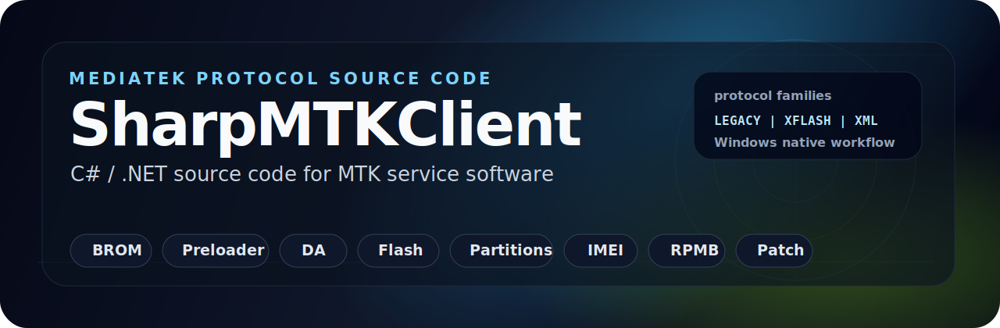

# SharpMTKClient

> Professional C# source code project for MediaTek / MTK protocol development on Windows.

## Documentation

* [Features](docs/FEATURES.md)
* [Advanced Service Features](docs/ADVANCED_SERVICE_FEATURES.md)
* [Update History](docs/UPDATE_HISTORY.md)
* [Media Gallery](docs/MEDIA.md)
* [Feature Matrix](docs/FEATURE_MATRIX.md)
* [Architecture](docs/ARCHITECTURE.md)
* [Module Catalog](docs/MODULE_CATALOG.md)
* [Buyer Guide](docs/BUYER_GUIDE.md)
* [Support Policy](docs/SUPPORT_POLICY.md)
* [Links](docs/LINKS.md)

## Overview

**SharpMTKClient** is a Windows GUI source-code project written in C# by Alephgsm for MediaTek chipset devices.

The project is designed for developers, researchers and software owners who want a private MTK service software foundation instead of a closed binary. The full commercial source code is provided privately to licensed buyers only.

SharpMTKClient supports MTK protocol workflows including BROM / Preloader communication, Download Agent handling, LEGACY, XFLASH and MTK V6 XML operations, firmware flashing, partition management, file-system access, NV / IMEI logic, RPMB paths and advanced patch/service modules.

USB communication is based on Windows APIs. It has no UsbDk dependency; libusb is used only for selected `ControlTransfer` paths.

## Core Protocol Families

| Protocol | Purpose |
| --- | --- |
| **LEGACY** | Classic DA-based MediaTek workflow. |
| **XFLASH** | Modern DA workflow with native partition-oriented operations. |
| **XML** | MTK V6 / XML command flow for supported firmware packages and modes. |

Protocol availability depends on chipset, selected DA, boot mode, security state and target operation.

## Repository Notice

This public repository is for **product presentation only**.

It may include:

* README and product documentation.
* Feature descriptions.
* Demo links and media references.
* Contact and licensing information.

It does not include:

* Full commercial source code.
* Private protocol implementation.
* Payloads, loaders or protected assets.
* Sensitive security research files.
* Licensed customer-only material.

## Licensing and Purchase

The full SharpMTKClient source code is available by private licensing.

Commercial usage rules are described in [LICENSE_TERMS.md](LICENSE_TERMS.md).

For pricing, licensing terms, technical questions or purchase requests, contact:

<https://t.me/GsmCoder>

Product page:

<https://alephgsm.com/2022/01/13/csharp-mtkclient/>

## Disclaimer

SharpMTKClient is intended for developers, research teams and authorized service software development. Device operations may depend on chipset, boot mode, selected DA, firmware package, security state and local regulations.

Use this project only for lawful development, research, maintenance and authorized service scenarios.
